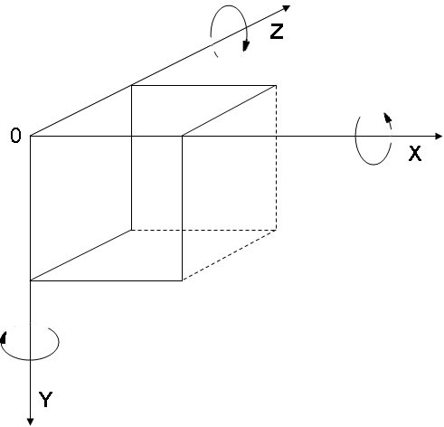
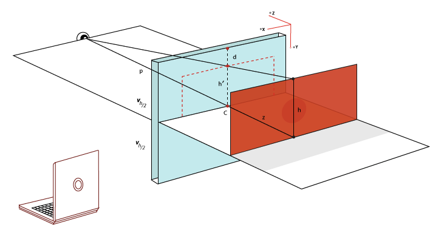
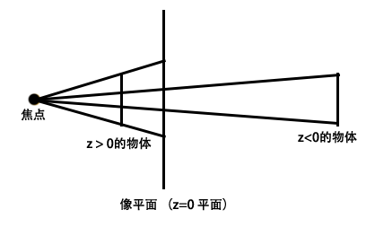

### 鼠标跟随的3D转动

首先，甩一枚简单的[demo](http://runjs.cn/detail/1hnseaw3)看下要实现的效果。点击右下角可查看源码。

ok，直接开干，这个demo里面主要用到了两个属性：`transform`和`perspective`。分别可以设置3D和透视投影的效果。

### 3D变换效果

首先介绍下`transform`，写过一丢丢动画的孩子都会接触过的属性。`CSS3`的3D效果是使用`transform`的`rotateX(Y, Z)`，`translateX(Y, Z)`，`scaleX(Y, Z)`方法进行设置的。

上图就是一个3D坐标系，需要注意的是，3D元素的原点应该是在元素的中心，而不是像上图一样在立方体的一个角上。如果只是单单一个元素的话，它的形状就是一个平面区域。下面简单介绍一下`transform`中相关的3D方法。

##### rotateX(Y, Z)

顾名思义就是绕着X轴（Y轴或者Z轴）旋转。注意：**逆时针为正方向**（如图）

##### translateX(Y, Z)

默认情况下，开启的是平面投影，所以此时设置`translateZ`是没有什么luan用的。那怎么生效呢，看下去才告诉你（╭(╯^╰)╮）。

##### scaleX(Y, Z)

缩放，好理解。偶尔会用来做字号的特殊处理，比如像chrome默认的最小字号是`12px`，要是你家视觉非要设置`10px`大小的字体咋整，那就给他一巴掌，叫他要求这么多（现实情况是可以用这个属性来解决……）。

题外话：chrome的默认最小字号可以在设置中更改，不过你的用户可不管这些。

----

##### transform-style属性

它有两个值：
* `flat`(默认，顾名思义就是平面状态，所以上面说的设置translateZ才会失效。)
* `preserve-3d`

聪明如你马上明白`preserve-3d`才是主角，设置了`transform-style: preserve-3d`的父元素会生成一个3D空间，把所有的**子元素**都包括在这个3D空间内。

**注意**：上面说的是**子元素** ，不是**后代元素**，看看demo中的`我是preserve-3d的孙子`这行字所在的元素，Z值和它爸爸`黑月`是不同的，但是转动卡片发现，视觉效果上他们是在同一个Z值平面的。那要让孙子上的Z值也生效呢？啥，你还不知道！那你再看一遍上面的两段话- -。（答案：在`黑月`上再设置一次这个属性，可以在demo上尝试修改下看看）。

对于父元素设置的`transform`属性，都会应用到生成的这个3D空间，对整个空间进行3D操作（旋转，平移，缩放）。最后会把所有的元素投影到`屏幕`上，不是父元素上！

当`transform-style`的值为`flat`时，子元素和父元素是互相独立的，并没有在父元素的3D空间内，他们各自做各自的3D变换，然后**按照先后顺序**投影到父元素上。这也是`flat`时，translateZ失效的原因。

**tips**：设置在transform属性上的`rotateX(Y, Z)`，`translateX(Y, Z)`，`scaleX(Y, Z)`方法是从右向左执行的。

---

### 透视投影

透视投影是模拟人眼的图像观察方式，让平面上的物体呈现现实的视觉效果。

有两种设置方式：
* `perspective: none | <length>;`
* `transform: perspective(<length>) method(p) method(p) ...;`

第一种：可以将**子元素**(不包含自身，不包括后代元素)的投影效果设置为透视投影。
第二种：为这个元素自身开启透视投影模式。

先看下**3D视角**的原理图，来自[这里](https://css-tricks.com/tour-performant-responsive-css-site/)

图中淡蓝色部分即电脑屏幕所在的平面（z=0的平面），眼睛所在的位置就是通过`perspective`设置的模拟焦点位置，焦点到z=0平面的距离就是`perspective`的值，而橘红色部分就是设置了`translateZ`为负值的3D元素的所在平面，3D元素到z=0平面的距离就是3D元素上`translateZ`的值，如图为负值，如果在焦点和z=0及平面之间，则为正值。

这是透视的**平面**原理图，来自[这里](https://segmentfault.com/a/1190000003843764)。

通过这两张图，应该能够很直观的看出`perspective`和`translateZ`的设置对于3D元素在屏幕上产生的投影的效果了。当元素的z值大于'perspective'的值时，你就看不见它了，就像你的boss站在你的脑袋后面一样一样。一般情况下，'perspective'设置500px到1000px在视觉上比较合理。

在[demo](http://runjs.cn/detail/1hnseaw3)中，如果取消`perspective`透视属性，你会发现，卡片就像一个没固定好的相框在转动，这就算是透视属性的必要性。

透视投影还可以设置焦点的位置（默认在中心），因为你的脑袋也是可以动的：

`perspective-origin: x y;`

**到这里，3d和透视投影的相关属性就介绍完了，有什么不清楚的你可以改改[demo](http://runjs.cn/detail/1hnseaw3)测试下。**

对不起，还没完……

---

### 鼠标跟随的实现

关键是理清前面的属性，最后的鼠标跟随转动效果通过js实现应该比较简单了，监听`mousemove`事件，根据鼠标位置到3D元素的中心的`距离`，`除以`一定的`系数`，实时改变元素的`rotateX`和`rotateY`的值来达到效果。你可以通过改变`系数`的大小来控制`转动的灵敏度`。

贴一下代码：

        var o = $("#card");
        $("#top").on("mousemove", function(t) {
            var e = -($(window).innerWidth() / 2 - t.pageX) / 20,
                n = ($(window).innerHeight() / 2 - t.pageY) / 10;
            o.attr("style",
                "transform: rotateY(" + e + "deg) rotateX(" + n + "deg);
                -webkit-transform: rotateY(" + e + "deg) rotateX(" + n + "deg);
                -moz-transform: rotateY(" + e + "deg) rotateX(" + n + "deg)"
            )
        })

---

** THE END……能看到这里的人真是让俺感动啊~**

养成好习惯，顺手打广告：这个动效用在了[网易有数](https://youdata.netease.com/)的首页。**网易有数**是一款敏捷数据分析平台，欢迎使用体验。

参考自：
* [Tour of a Performant and Responsive CSS Only Site](https://css-tricks.com/tour-performant-responsive-css-site/)
* [3D效果 & 透视](https://segmentfault.com/a/1190000003843764)
